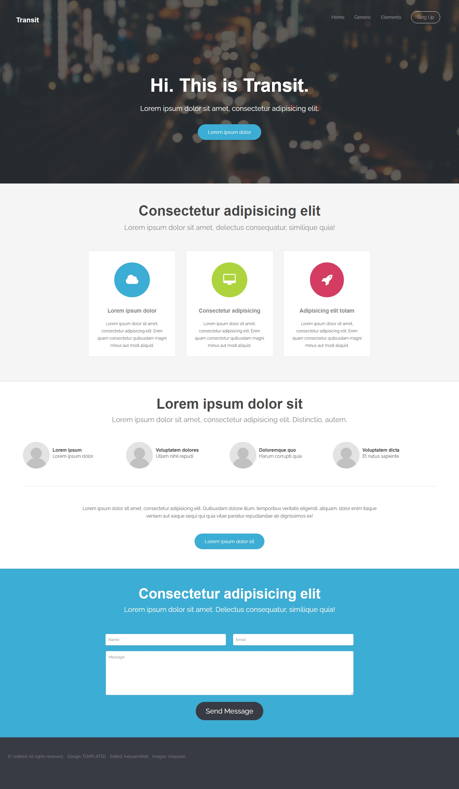

  <h1 align="left">Transit HTML Theme</h1>

This is a simple page transit html theme on HTML,CSS and fontawesome

Transit HTML Theme

 

---

## About

Displays a simple transit html theme demo. This theme is completely standard coded.
There is a free use theme on the web. 
But I tried to improve the coding by changing the coding structure.
I hope this theme is right for you.
Designed with HTML, CSS and fontawesome.

## Usage

You can use it for Theme HTML in the website.

